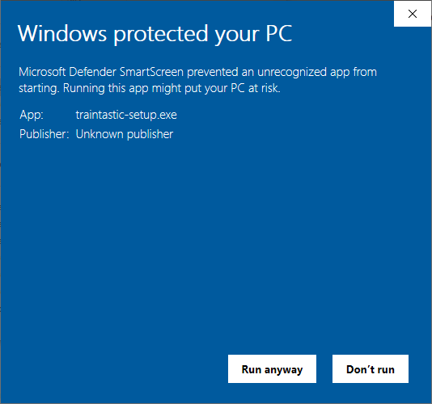
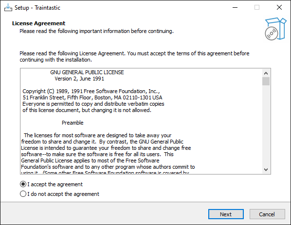
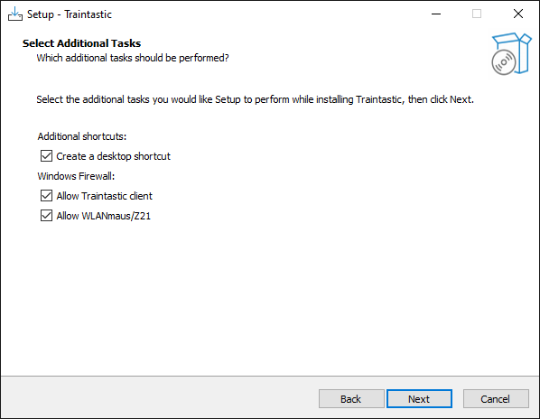
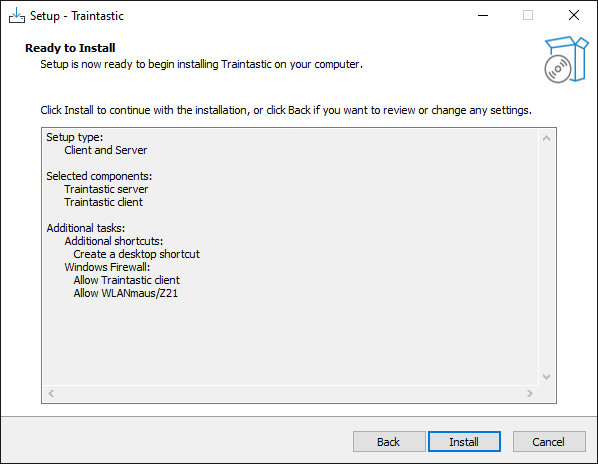

# Installation {#installation}

Installation is different based on the operating system used.
Hereafter the instructions for [Windows](#installation-windows) and [Linux](#installation-linux).

## Windows {#installation-windows}

Installation on Windows is very straight forward. Download the latest release from [traintastic.org/download](https://traintastic.org/download), run the installer and follow the steps below.

### Step 1: Windows defender

Click *More info* to show application information.

### Step 2: Windows defender

Click *Run anyway* to start the installer.

### Step 3: User Account Control

Click *Yes* to allow running the installer.

### Step 4: Select language

Select language for the installation wizard and click *Ok*.

### Step 5: Licence agreement

Select *I accept the agreement* and click *Next*.

### Step 6: Select components

Select *Client and Server* if this computer will control the layout or select *Client only* if this computer is used as additional computer to operate the layout. Then click *Next*.

### Step 7: Desktop shortcuts

Uncheck *Create a desktop shortcut* if you don't want desktop shortcuts to start Traintastic, then click *Next*.

### Step 8: Ready for installation

Click *Install* to start the installation of Traintastic.

### Step 9: Installation finished

Click *Finish* to exit the installer. Installation is now completed.

## Linux {#installation-linux}

Download the latest client and/or server package for your distribution at [traintastic.org/download](https://traintastic.org/download) and install is using your graphical package manager or by running `sudo dpkg -i package_name.deb` in the console.
